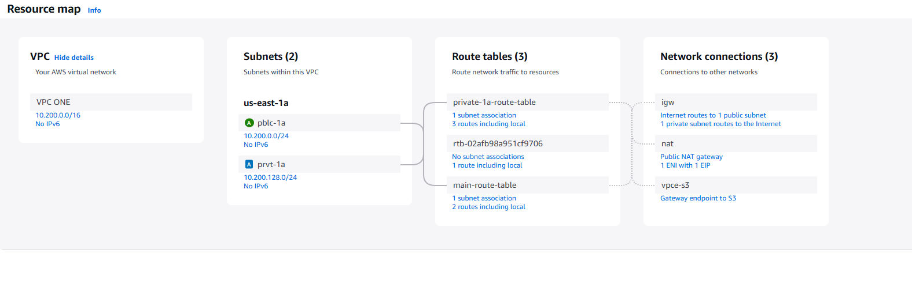

# 🌐 AWS VPC Showcase 🚀


An interactive and modern **AWS Virtual Private Cloud (VPC) showcase** website that provides insights into VPC architecture, best practices, Terraform scripts, and live demonstrations.

---

## 🎯 **Project Overview**
This project serves as a **visual and interactive guide** to AWS **VPC networking concepts**, including:
- 🌍 **VPC Architecture** with subnet configurations  
- 📜 **Step-by-step guides** for setting up VPC components  
- 🔗 **Terraform automation scripts** for easy deployment  
- 📚 **AWS networking best practices**  
- 🎨 **Modern UI with interactive elements**  

---

## 📸 **Screenshots**


---

## 🛠️ **Tech Stack**
| Technology | Description |
|------------|-------------|
| 🖥️ HTML5 | Structuring the web pages |
| 🎨 CSS3 | Styling with modern UI design |
| ⚡ JavaScript (ES6+) | Interactivity & animations |
| 🏗️ Terraform | Infrastructure as Code (IaC) for AWS |
| ☁️ AWS | Hosting & VPC networking |

---

## 🔥 **Features**
✅ **Modern UI** with smooth animations & dark mode  
✅ **Interactive navbar** with smooth scrolling  
✅ **Typewriter effect** for dynamic text  
✅ **Image popups** on click  
✅ **Floating particles animation**  
✅ **Scroll progress bar**  
✅ **Keyboard navigation** (⬆️ & ⬇️ to switch sections)  
✅ **Back-to-top button**  
✅ **Dark mode with local storage**  

---

## 📦 **Installation & Setup**
Clone the repository and run the project locally:
```bash
git clone https://github.com/your-username/aws-vpc-showcase.git
cd aws-vpc-showcase
